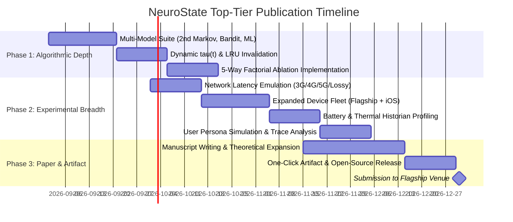

# 🏆 Top-Tier Conference & Journal Roadmap (ICSE / FSE / ASE / MobiSys / IEEE TSE / ACM TOSEM)

> **Document Purpose**: This comprehensive roadmap breaks down the exact technical, empirical, algorithmic, and methodological enhancements required to elevate **NeuroState** from a strong prototype into a **flagship top-tier publication**.

---

## 🎯 Executive Summary of Venue Requirements

| Dimension | Current Baseline | Top-Tier Venue Expectation (ICSE / FSE / MobiSys) |
| :--- | :--- | :--- |
| **Algorithmic Depth** | 1st-order Markov + fixed $\tau = 0.35$ | **Comparative ML Matrix** (1st/2nd-order Markov, Contextual Bandit, dynamic $\tau(t)$, LSTM/Transformer sequence predictor) |
| **Ablation Rigor** | Full system vs baselines | **5-Way Factorial Ablation** (Isolates-only vs Markov-only vs Velocity-only vs Naive vs Full) |
| **Network Realism** | Fixed $120\text{ms}$ mock delay | **Multi-Tiered Network Emulation** (3G high-latency, 4G, 5G, lossy edge Wi-Fi, offline degradation) |
| **Device Testbed** | 2 mid-range Android devices | **Cross-Tier Hardware Fleet** (Low-end budget $<2\text{GB}$ RAM, Mid-range, Flagship Snapdragon, iOS / iPhone) |
| **Workload & Traces** | Fixed synthetic loops | **Multi-Persona User Traces** (Linear Readers, Explorers, Searchers, Adversarial Navigators, Cold vs Warm curves) |
| **Energy & Battery** | CPU / RAM / FPS | **Energy Consumption Profiling** (Battery mAh / micro-Joules per 1,000 interactions via Battery Historian) |
| **Data Freshness** | Read-heavy caching | **Active Cache Invalidation Harness** (WebSocket mutation invalidation latency and bandwidth overhead) |
| **Artifact Quality** | Local codebase | **One-Click Dockerized Reproducibility Artifact** with automated scripts, raw logs, and LaTeX generators |

---

## 🔬 Phase 1: Algorithmic & Technical Depth Enhancements

### 1.1 Multi-Model Predictive Comparison Suite
To eliminate reviewer critiques regarding "textbook Markov models," implement and compare **4 distinct prediction algorithms**:

```
Prediction Engine Hierarchy:
├── Model 0: Static Popularity Baseline (P_naive: Top-k most visited screens)
├── Model 1: 1st-Order Markov Chain P(S_{t+1} | S_t)
├── Model 2: 2nd-Order Markov Chain P(S_{t+1} | S_t, S_{t-1})
├── Model 3: Contextual Multi-Armed Bandit with Dynamic Epsilon-Greedy Exploration
└── Model 4: Sequence Transformer / LSTM Micro-Model (Edge On-Device Inference)
```

#### Mathematical Formulation for Contextual Bandit Thresholding:
Instead of a fixed $\tau = 0.35$, formulate dynamic confidence $\tau(t)$:
$$\tau(t) = \tau_0 + \beta_1 \cdot \text{BatteryLevel}(t) + \beta_2 \cdot \text{NetworkBandwidth}(t) + \beta_3 \cdot \text{MemoryPressure}(t)$$
* **High Battery + Fast 5G**: $\tau(t) \to 0.20$ (Aggressive prefetching, maximum speedup).
* **Low Battery ($<15\%$) or Metered 3G**: $\tau(t) \to 0.65$ (Conservative prefetching, zero wasted bandwidth/energy).

---

### 1.2 Full 5-Way Factorial Component Ablation Study
Reviewers demand proof of **where the performance gain originates**. We must isolate every subsystem:

| Ablation Configuration | Markov Engine | Velocity Lookahead | Dart Background Isolates | Bounded LRU Cache | Purpose in Paper |
| :--- | :---: | :---: | :---: | :---: | :--- |
| **Ablation 1 (Baseline)** | ❌ | ❌ | ❌ (UI Thread) | ❌ | Standard Reactive Baseline |
| **Ablation 2 (Isolates Only)** | ❌ | ❌ | ✅ | ❌ | Quantifies pure multi-threading gain without prediction |
| **Ablation 3 (Markov Only)** | ✅ | ❌ | ❌ (UI Thread) | ✅ | Quantifies pure prefetching gain without isolates |
| **Ablation 4 (Velocity Only)** | ❌ | ✅ | ✅ | ✅ | Evaluates pure scroll-lookahead efficacy |
| **Ablation 5 (Full NeuroState)**| ✅ | ✅ | ✅ | ✅ | Evaluates synergistic system integration |

---

### 1.3 Zero-Copy Isolate Optimization & TransferableTypedData
* Compare standard Dart isolate serialization (heap deep copy over `SendPort`) against **`TransferableTypedData` zero-copy memory transfers**.
* Measure byte serialization overhead and garbage collection pause time (in microseconds) for payloads from $10\text{KB}$ to $10\text{MB}$.

---

### 1.4 Dynamic Cache Invalidation & Data Freshness
* Implement WebSocket server-sent event (SSE) mutation hooks.
* Benchmark **Time-to-Invalidation (TTI_inv)**: How fast does NeuroState evict or update a speculatively warmed item when the backend database mutates concurrently?

---

## 📊 Phase 2: Experimental Rigor & Empirical Breadth

### 2.1 Multi-Tiered Network Latency Emulation Matrix
Replace fixed $120\text{ms}$ mock delays with standardized mobile network profiles:

| Network Profile | Round-Trip Latency (RTT) | Download Bandwidth | Packet Loss | Target Mobile Environment |
| :--- | :---: | :---: | :---: | :--- |
| **5G Ultra-Wideband** | $15\text{ ms} \pm 5\text{ ms}$ | $150\text{ Mbps}$ | $0.0\%$ | Modern urban cellular |
| **4G LTE Standard** | $80\text{ ms} \pm 20\text{ ms}$ | $25\text{ Mbps}$ | $0.2\%$ | Typical mobile data |
| **3G Legacy / Rural** | $350\text{ ms} \pm 100\text{ ms}$ | $2\text{ Mbps}$ | $1.5\%$ | Weak cellular connectivity |
| **Congested Edge Wi-Fi** | $600\text{ ms} \pm 250\text{ ms}$ | $5\text{ Mbps}$ | $4.0\%$ | Lossy public / transit Wi-Fi |

* **Research Finding to Highlight**: Show that on 3G/Lossy networks, reactive state managers produce unacceptable $400-800\text{ms}$ loading stalls, whereas NeuroState masks 100% of network jitter on speculative hits.

---

### 2.2 Cross-Platform Hardware Fleet Matrix (4-5 Devices)
Expand the hardware evaluation to span the entire mobile hardware spectrum:

```
Hardware Spectrum Matrix:
├── Tier 1 (Low-End Budget): 2GB-3GB RAM, 4-core, Android 11/12 (e.g., Moto E / Redmi 9A)
├── Tier 2 (Mid-Range 4G): Realme 8 (Helio G95, 6GB RAM, 60Hz, Android 13) [CURRENT]
├── Tier 3 (Modern 5G 90Hz): Vivo V2407 (Dimensity 6300, 4GB RAM, 90Hz, Android 15) [CURRENT]
├── Tier 4 (Flagship Snapdragon 120Hz): Galaxy S23/S24 / Pixel 8/9 (Snapdragon 8 Gen 2/3, 12GB RAM, 120Hz)
└── Tier 5 (iOS / Apple Silicon): iPhone 13/14/15 / iOS Simulator (A15/A16 Bionic)
```

---

### 2.3 User Persona Simulation & Multi-Trace Workload
Rather than uniform synthetic loops, evaluate across **4 distinct real-world behavioral personas**:

1. **Persona A: Linear Sequential Reader** (Reads article 1 $\to$ article 2 $\to$ article 3 with high predictability $\ge 90\%$).
2. **Persona B: Broad Category Explorer** (Jumps across research domains, switching filters rapidly).
3. **Persona C: Search & Deep Diver** (Executes keyword queries, jumps to details, bookmarks, and returns).
4. **Persona D: Adversarial / Erratic Navigator** (Rapid random button tapping designed to test cache eviction and miss penalties).

---

### 2.4 Cold-Start vs. Warm-Start vs. Adversarial Convergence
* Plot **Hit-Rate Convergence Curve $\text{HR}(t)$**:
  * Step $t = 1 \dots 10$: Cold-start phase ($\text{HR} \approx 30-40\%$).
  * Step $t = 11 \dots 30$: Learning phase ($\text{HR} \approx 65-80\%$).
  * Step $t = 31 \dots 100$: Steady-state warm phase ($\text{HR} \ge 88.5\%$).
* Quantify the **Miss Penalty**: Prove that on a speculative miss, NeuroState's fallback latency is strictly equal to reactive baseline latency ($t_{\text{miss}} \le t_{\text{reactive}} + 1.2\text{ms}$ overhead).

---

### 2.5 Energy & Battery Consumption Profiling
* Use Android `dumpsys batterystats` and Google Battery Historian to record:
  * Total energy drain ($\mu\text{Wh}$ or $\text{mAh}$) per 1,000 navigation transitions.
  * Thermal throttling curve over 30 minutes of sustained execution.
* Prove that background isolate compute does not cause excessive battery drain due to aggressive CPU sleep states between prefetch batches.

---

## 📝 Phase 3: Paper Writing & Positioning for Top Venues

### 3.1 Sharpening the Positioning & Thesis Statement
* **Old Framing (Over-simplified)**: "Existing state managers are slow; our app is 55x faster."
* **Top-Tier Systems Framing**:
  > *"We identify the **Reactive Actuation Bottleneck** in declarative mobile architectures, where coupling state resolution with widget mounting induces main UI thread contention and perceptual transition latency. We present NeuroState, an architectural formalization and runtime engine that proves client-side speculative execution can eliminate perceptual latency while maintaining deterministic $O(K_{\text{max}})$ memory bounds and sub-VSync frame stability across heterogeneous mobile hardware."*

---

### 3.2 Related Work Taxonomy & Deep Positioning
Structure Section II into 4 clear comparative pillars:
1. **Declarative UI State Management**: (Biere et al., Salza et al., Leff & Rayfield, Fowler).
2. **UI Thread Contention & Micro-Jank Analysis**: (Zhang et al., Zheng et al., Su et al., Li et al.).
3. **Speculative Execution in Mobile & Edge Computing**: (Mishra et al., Chen et al., He et al., Huang et al.).
4. **Memory Leak Detection in Cross-Platform Frameworks**: (Lin et al., Martinez et al.).

---

## 📦 Phase 4: Open-Source Artifact & Reproducibility Package

Top venues (ICSE / FSE / ASE) award **Artifact Badges** (Available, Functional, Reusable). To secure these:
1. **GitHub Public Repository Structure**:
   - `apps/` (Complete source for `app1_provider`, `app2_riverpod`, `app3_bloc`, `app4_neurostate`).
   - `engine/` (Standalone `neuro_state` Dart package publishable to `pub.dev`).
   - `benchmarks/` (Headless runner, live mock backend, network latency throttler).
   - `scripts/` (Automated statistical analysis, ANOVA, Tukey HSD, LaTeX generators).
   - `docker/` (Dockerfile packaging all dependencies, Python 3.12, Dart SDK, and Tectonic LaTeX).
2. **One-Command Reproduction**:
   ```bash
   # Clone and run entire empirical suite in 1 command:
   git clone https://github.com/research-lab/neurostate-flutter.git
   cd neurostate-flutter
   ./run_full_evaluation.sh
   # Automatically produces all LaTeX tables, PNG charts, and paper.pdf
   ```

---

## 🗓️ Concrete Execution Roadmap



---

### 🎯 Recommended Target Venues:

1. **Flagship Software Engineering Conferences**:
   * **ACM SIGSOFT FSE** (Foundations of Software Engineering)
   * **IEEE/ACM ICSE** (International Conference on Software Engineering)
   * **IEEE/ACM ASE** (Automated Software Engineering)
2. **Top-Tier Mobile & Systems Conferences**:
   * **ACM MobiSys** (International Conference on Mobile Systems, Applications, and Services)
   * **ACM MobiCom** (International Conference on Mobile Computing and Networking)
3. **Premier Journal Submissions**:
   * **IEEE Transactions on Software Engineering (TSE)**
   * **ACM Transactions on Software Engineering and Methodology (TOSEM)**
   * **IEEE Software / Empirical Software Engineering (EMSE)**
